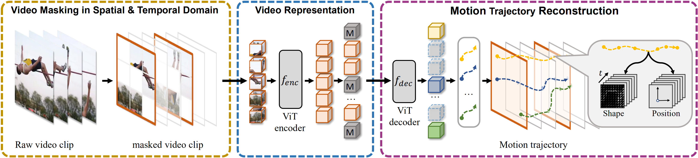

# Official PyTorch Implementation of MME (CVPR2023)


[](https://paperswithcode.com/sota/self-supervised-action-recognition-on-hmdb51?p=m-3-video-masked-motion-modeling-for-self)<br>
[](https://paperswithcode.com/sota/self-supervised-action-recognition-on-ucf101?p=m-3-video-masked-motion-modeling-for-self)

> [**Masked Motion Encoding for Self-Supervised Video Representation Learning**](https://arxiv.org/abs/2210.06096) \
> Xinyu Sun, Peihao Chen, Liangwei Chen, Changhao Li, Thomas H. Li, Mingkui Tan, Chuang Gan

<span id="main-results"></span>

## Main Results

### UCF101 & HMDB51
| Method | Pre-train Data | Fine-tune Data | Backbone | Acc@1 |  Download Link |
|:------:|:--------------:|:--------------:|:--------:|:-----:|:--------------:|
|   MME  |      K400      |     UCF101     |   ViT-B  |  96.5 | [log](https://drive.google.com/file/d/1-nPuA9Q5RTsyoytTGMUxSbyW8o-PDef9/view?usp=share_link)/[cow](https://scut.cowtransfer.com/s/91846e3697f245)/[google](https://drive.google.com/file/d/1ZvXLBMXTxcEMAzwCRULbeaurb26k3rSu/view?usp=share_link) |
|   MME  |      K400      |     HMDB51     |   ViT-B  |  78.0 | [log](https://drive.google.com/file/d/1054npYEEC09eGvodr-muVhSrOfl9WDZ8/view?usp=share_link)/[cow](https://scut.cowtransfer.com/s/d2c6cb81f1194a)/[google](https://drive.google.com/file/d/10BeRaEfUr7cGQHvwzLm0A1QtdbHF5e-N/view?usp=share_link) |

### Kinetics-400 (K400)
| Method | Pre-train Data | Backbone | Epoch | #Frames x Clips x Crops | Acc@1 |  Download Link |
|:------:|:--------------:|:--------:|:-----:|:-----------------------:|:-----:|:--------------:|
|   MME  |      K400      |   ViT-B  |  1600 |          16x7x3         |  81.8 | [log](https://drive.google.com/file/d/1-eTtG4tJE-mjrlctc7FHgXzx8Sb1NaHG/view?usp=share_link)/[cow](https://scut.cowtransfer.com/s/c5d32cacdce14d)/[google](https://drive.google.com/file/d/1XmefyY1MYJZ6h0gdS92wE8BuetLdNsgj/view?usp=share_link) |

### Something-Something V2 (SSV2)
| Method | Pre-train Data | Backbone | Epoch | #Frames x Clips x Crops | Acc@1 |  Download Link |
|:------:|:--------------:|:--------:|:-----:|:-----------------------:|:-----:|:--------------:|
|   MME  |      SSV2      |   ViT-B  |  400  |          16x2x3         |  69.2 | [log](https://drive.google.com/file/d/14qe3zVB6YSFpHFL6DXq5l8TgJXzuyeX7/view?usp=share_link)/[cow](https://scut.cowtransfer.com/s/e58dd323f4b748)/[google](https://drive.google.com/file/d/1uNqJ36A-OcB-5qmNuti1NO6mPr___gco/view?usp=share_link) |
|   MME  |      K400      |   ViT-B  |  400  |          16x2x3         |  69.5 | [log](https://drive.google.com/file/d/1A_SPGnGSFereJOTKdTYkEL1vdLTCzAhS/view?usp=share_link)/[cow](https://scut.cowtransfer.com/s/1e1c8f106a674e)/[google](https://drive.google.com/file/d/1whzFzCOvjQD0mEa76QsuoZWiZJVXSwdf/view?usp=share_link) |
|   MME  |      K400      |   ViT-B  |  800  |          16x2x3         |  70.5 | [log](https://drive.google.com/file/d/1xhdc-KHkenknwRM69NijA8D_98jNizsS/view?usp=share_link)/[cow](https://scut.cowtransfer.com/s/71450a37c91f40)/[google](https://drive.google.com/file/d/1vOi-Mjwgi2C9K_KB1NYN-Hd9Gh759t9d/view?usp=share_link) |
|   MME  |      K400      |   ViT-B  |  1600 |          16x2x3         |  71.5 |[log](https://drive.google.com/file/d/1OSOuLeTQpcNvKM8eUXrItXDyU2xLvNDa/view?usp=share_link)/[cow](https://scut.cowtransfer.com/s/61a435c7fb8a49)/[google](https://drive.google.com/file/d/1DQitcYzOKlNf3Mc3PF_EewxJ3DQsl-2c/view?usp=share_link) |

## Model Zoo
### Pre-trained Weight

| Method | Pre-train Data | Backbone | Epoch | Download Link  |
|:------:|:--------------:|:--------:|:-----:|:--------------:|
|   MME  |      K400      |   ViT-B  |  1600 |  [google](https://drive.google.com/file/d/1XtokRIr9OA5mzRMnCjAsdLtt83vkR44W/view?usp=share_link)/[cow](https://scut.cowtransfer.com/s/8535f5ba8a9043)  |
|   MME  |      K400      |   ViT-B  |  800  |  [google](https://drive.google.com/file/d/16tSMcdJFV7Yt_DICvgV--bg4Ddrooy0o/view?usp=share_link)/[cow](https://scut.cowtransfer.com/s/9e7c43db04cf4d)  |
|   MME  |      SSV2      |   ViT-B  |  400  |  [TODO]  |

## Prepare Environment
Run [install.sh](scripts/tools/install.sh) to create environment and install packages.
```bash
cd ${MME_FOLDER_BASE} # cd the code base of MME

export CUDA_HOME=${PATH_TO_CUDA}
export PYTHONPATH=$PYTHONPATH:`pwd`

source scripts/tools/install.sh
```
> Troubleshooting: replace the compiled cuda version of torch/torchvision in the install.sh with your installed cuda version.

## Prepare Datasets
In this step, we will put the dataset folder into this work space. In our experiments, we use `Kinetics-400`, `Something-Something V2`, `UCF101`, and `HMDB51` four datasets.
```bash
mkdir data
ln -s ${PATH_TO_DATASET} data/
```

After this process, the data folder should be organized as follows:
```
data/
├── csv
│   └── k400
│       ├── train.csv
│       ├── val.csv
│       └── test.csv
├── kinetics400
│   ├── train_video
│   │   └── abseiling
│   │       └── ztuc7tVNUDo_000003_000013.mp4
│   └── val_video
├── smth-smth-v2
│   ├── 20bn-something-something-v2
│   │   └── 8192.mp4
│   └── annotations
├── UCF101
│   ├── UCF-101
│   │   └── ApplyEyeMakeup
│   │       └── v_ApplyEyeMakeup_g24_c05.avi
│   └── ucfTrainTestlist
└── hmdb51
    ├── videos
    │   └── brush_hair
    │       └── Silky_Straight_Hair_Original_brush_hair_h_nm_np1_ba_goo_0.avi
    └── metafile
```

> We use the csv file to provide data lists with video path for train, val and test. As the csv file can be customized, the data folder can be organized as you preferred. Default csv files can be found [here](https://drive.google.com/drive/folders/10EwqsS3KTMbkfGivHgKZyMwhro6GP84i?usp=share_link).

## Prepare Motion Trajectory
<span id="A-using-pre-extracted"></span>

### A. Using Pre-extracted Motion Trajectories
We provide [pre-extracted motion trajectories](https://pan.baidu.com/s/1VTlzmRpmvxtVmBY3eUSTgw?pwd=cvpr) for MME pre-training on Kinetics-400 dataset. Decompress and put it into `data/trajs/kinetics400`. The trajs folder should be organized as follows:
```bash
data/trajs
└── kinetics400
    └── train_video
        └── abseiling
            └── ztuc7tVNUDo_000003_000013.mp4_4.gz
```

### B. Extract Motion Trajectories From Scratch
See [EXTRACT_FEATURE.md](EXTRACT_FEATURE.md) for details.

## Run MME
### 1. Pretrain the Model Using MME
To pretrain the model on K400 on 2 nodes with 8 x a100(80G) GPUs on each, we set `NUM_PROCESS` = 8, `NUM_NODES`=2, `BATCH_SIE` = 64.
```bash
bash scripts/pretrain/k400-1600epo.sh 8 2 0 MASTER_IP 64
```

### 2. Finetune the Model on Downstream Datasets
```bash
bash scripts/finetune/ssv2/k400pt-800epo.sh 8 2 0 MASTER_IP 28
```
We also provide finetuned models in the [Main Results](#main-results), you are free to download them and run eval directly.

```bash
# first: download the checkpoint and put it into the OUTPUT_DIR
exps/m3video/
└── finetune
    └── ssv2
        └── k400pt-1600epo
            └── checkpoint-best
                └── mp_rank_00_model_states.pt

# sceond: run eval!
bash scripts/finetune/ssv2/k400pt-1600epo.sh 8 1 0 localhost 28 --eval
```

## Cite MME
Please star the project and cite our paper if it is helpful for you~
```
@inproceedings{sun2023mme,
  title={Masked Motion Encoding for Self-Supervised Video Representation Learning},
  author={Sun, Xinyu and Chen, Peihao and Chen, Liangwei and Li, Changhao and Li, Thomas H and Tan, Mingkui and Gan, Chuang},
  booktitle={The IEEE/CVF Conference on Computer Vision and Pattern Recognition (CVPR)},
  year={2023}
}

@article{sun2022m3video,
  title={M $\^{} 3$ Video: Masked Motion Modeling for Self-Supervised Video Representation Learning},
  author={Sun, Xinyu and Chen, Peihao and Chen, Liangwei and Li, Thomas H and Tan, Mingkui and Gan, Chuang},
  journal={arXiv preprint arXiv:2210.06096},
  year={2022}
}
```

## Acknowledgements
Our code is modified from [VideoMAE](https://github.com/MCG-NJU/VideoMAE). Thanks for their awesome work!